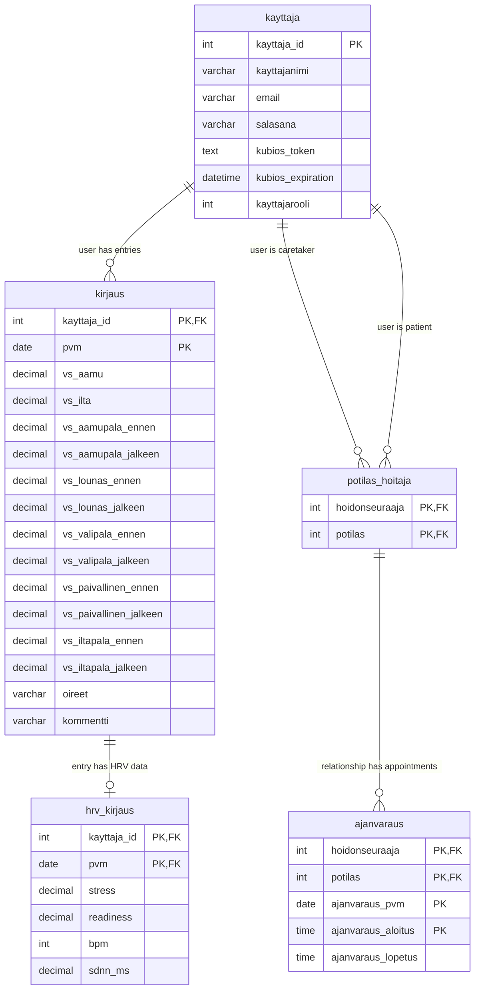

# DATABASE.md - DiaBalance Tietokantadokumentaatio

## Yleiskuvaus

DiaBalance-sovelluksen tietokantarakenne tukee käyttäjien hallintaa, verensokerimerkintöjen tallennusta, HRV-datan integrointia sekä hoitaja-potilassuhteiden hallintaa.

## Tietokantarakenne

Tietokanta koostuu viidestä päätaulusta:

1. **kayttaja** - Käyttäjätiedot ja autentikointi
2. **kirjaus** - Verensokerimerkinnät
3. **hrv_kirjaus** - HRV-mittaukset (Heart Rate Variability)
4. **potilas_hoitaja** - Potilas-hoitajasuhteet (määritelty jatkokehitystä varten, ei käytössä nykyisessä toteutuksessa)
5. **ajanvaraus** - Ajanvaraustiedot (määritelty jatkokehitystä varten, ei käytössä nykyisessä toteutuksessa)



> **Huomio:** `potilas_hoitaja` ja `ajanvaraus` -taulut on määritelty tietokantaskeemassa, mutta ne eivät ole nykyisessä koodissa käytössä aikaresurssin puutteen vuoksi. Ne ovat mukana jatkokehitystä varten.

### Taulujen rakenne

#### kayttaja

Tallentaa käyttäjien perustiedot, tunnukset ja roolit.

| Kenttä | Tyyppi | Kuvaus | Lisätiedot |
| ------ | ------ | ------ | ---------- |
| kayttaja_id | INT | Käyttäjän yksilöllinen tunniste | AUTO_INCREMENT, PRIMARY KEY |
| kayttajanimi | VARCHAR(40) | Käyttäjätunnus | NOT NULL |
| email | VARCHAR(255) | Sähköpostiosoite | NOT NULL |
| salasana | VARCHAR(60) | Bcrypt-suojattu salasana | NOT NULL |
| kubios_token | TEXT | Kubios API -autentikointitoken | NULL sallittu |
| kubios_expiration | DATETIME | Kubios-tokenin vanhentumisaika | NULL sallittu |
| kayttajarooli | INT | Käyttäjän rooli järjestelmässä | NOT NULL, DEFAULT 0 |

**Rajoitteet:**
- PRIMARY KEY (kayttaja_id)
- CHECK (kayttajarooli >= 0 AND kayttajarooli <= 2)

**Roolit:**
- 0 = Potilas
- 1 = Hoitaja/hoidonseuraaja
- 2 = Järjestelmänvalvoja

#### kirjaus

Tallentaa käyttäjien verensokerimerkinnät päiväkohtaisesti.

| Kenttä | Tyyppi | Kuvaus | Lisätiedot |
| ------ | ------ | ------ | ---------- |
| kayttaja_id | INT | Käyttäjän tunniste | NOT NULL, FOREIGN KEY |
| pvm | DATE | Merkinnän päivämäärä | NOT NULL, DEFAULT CURRENT_DATE() |
| vs_aamu | DECIMAL(3,1) | Aamuarvo (mmol/l) | NULL sallittu |
| vs_ilta | DECIMAL(3,1) | Ilta-arvo (mmol/l) | NULL sallittu |
| vs_aamupala_ennen | DECIMAL(3,1) | Arvo ennen aamupalaa | NULL sallittu |
| vs_aamupala_jalkeen | DECIMAL(3,1) | Arvo aamupalan jälkeen | NULL sallittu |
| vs_lounas_ennen | DECIMAL(3,1) | Arvo ennen lounasta | NULL sallittu |
| vs_lounas_jalkeen | DECIMAL(3,1) | Arvo lounaan jälkeen | NULL sallittu |
| vs_valipala_ennen | DECIMAL(3,1) | Arvo ennen välipalaa | NULL sallittu |
| vs_valipala_jalkeen | DECIMAL(3,1) | Arvo välipalan jälkeen | NULL sallittu |
| vs_paivallinen_ennen | DECIMAL(3,1) | Arvo ennen päivällistä | NULL sallittu |
| vs_paivallinen_jalkeen | DECIMAL(3,1) | Arvo päivällisen jälkeen | NULL sallittu |
| vs_iltapala_ennen | DECIMAL(3,1) | Arvo ennen iltapalaa | NULL sallittu |
| vs_iltapala_jalkeen | DECIMAL(3,1) | Arvo iltapalan jälkeen | NULL sallittu |
| oireet | VARCHAR(200) | Oirekuvaus | DEFAULT "Ei oireita" |
| kommentti | VARCHAR(500) | Lisäkommentit | DEFAULT "Ei kommentteja" |

**Rajoitteet:**
- PRIMARY KEY (kayttaja_id, pvm)
- FOREIGN KEY (kayttaja_id) REFERENCES kayttaja(kayttaja_id)
- INDEX idx_pvm (pvm)

#### hrv_kirjaus

Tallentaa Kubios API:sta saadut HRV-mittaustulokset, jotka on liitetty verensokerimerkintöihin.

| Kenttä | Tyyppi | Kuvaus | Lisätiedot |
| ------ | ------ | ------ | ---------- |
| kayttaja_id | INT | Käyttäjän tunniste | NOT NULL, FOREIGN KEY |
| pvm | DATE | Mittauksen päivämäärä | NOT NULL, FOREIGN KEY |
| stress | DECIMAL(4,1) | Stressitaso (Baevskyn indeksi) | NULL sallittu |
| readiness | DECIMAL(4,1) | Valmiusaste (Readiness Score) | NULL sallittu |
| bpm | INT | Sydämen keskisyke (lyöntiä/min) | NULL sallittu |
| sdnn_ms | DECIMAL(4,1) | SDNN-arvo (ms) | NULL sallittu |

**Rajoitteet:**
- PRIMARY KEY (kayttaja_id, pvm)
- FOREIGN KEY (kayttaja_id, pvm) REFERENCES kirjaus(kayttaja_id, pvm)

#### potilas_hoitaja (jatkokehitystä varten)

Määrittelee potilaiden ja hoitajien väliset suhteet.

| Kenttä | Tyyppi | Kuvaus | Lisätiedot |
| ------ | ------ | ------ | ---------- |
| hoidonseuraaja | INT | Hoitajan tunniste | NOT NULL, FOREIGN KEY |
| potilas | INT | Potilaan tunniste | NOT NULL, FOREIGN KEY |

**Rajoitteet:**
- PRIMARY KEY (hoidonseuraaja, potilas)
- FOREIGN KEY (hoidonseuraaja) REFERENCES kayttaja(kayttaja_id)
- FOREIGN KEY (potilas) REFERENCES kayttaja(kayttaja_id)
- INDEX idx_potilas (potilas)

#### ajanvaraus (jatkokehitystä varten)

Tallentaa hoitajan ja potilaan välisten tapaamisten ajanvaraukset.

| Kenttä | Tyyppi | Kuvaus | Lisätiedot |
| ------ | ------ | ------ | ---------- |
| hoidonseuraaja | INT | Hoitajan tunniste | NOT NULL, FOREIGN KEY |
| potilas | INT | Potilaan tunniste | NOT NULL, FOREIGN KEY |
| ajanvaraus_pvm | DATE | Ajanvarauksen päivämäärä | NOT NULL |
| ajanvaraus_aloitus | TIME | Ajanvarauksen alkamisaika | NOT NULL |
| ajanvaraus_lopetus | TIME | Ajanvarauksen päättymisaika | NOT NULL |

**Rajoitteet:**
- PRIMARY KEY (hoidonseuraaja, potilas, ajanvaraus_pvm, ajanvaraus_aloitus)
- FOREIGN KEY (hoidonseuraaja, potilas) REFERENCES potilas_hoitaja(hoidonseuraaja, potilas)
- INDEX idx_potilas (potilas)
- INDEX idx_pvm (ajanvaraus_pvm)

## Triggerit

Tietokannassa on määritelty triggereitä, jotka varmistavat tietojen eheyden ja liiketoimintasääntöjen noudattamisen:

### 1. onko_potilas_kirjaus

Tarkistaa, että kirjauksen tekijällä on potilasrooli (kayttajarooli = 0).

```sql
CREATE TRIGGER onko_potilas_kirjaus BEFORE INSERT ON kirjaus
FOR EACH ROW
BEGIN
    DECLARE k_rooli INT;
    SELECT kayttajarooli INTO k_rooli
    FROM kayttaja
    WHERE kayttaja_id = NEW.kayttaja_id;
    IF k_rooli != 0 THEN
        SIGNAL SQLSTATE '45000' SET MESSAGE_TEXT = 'Kirjauksen tekijä täytyy olla potilas';
    END IF;
END;
```

### 2. onko_potilas

Varmistaa, että potilas-hoitaja-suhteessa potilaan rooli on potilas (kayttajarooli = 0).

```sql
CREATE TRIGGER onko_potilas BEFORE INSERT ON potilas_hoitaja
FOR EACH ROW
BEGIN
    DECLARE k_rooli INT;
    SELECT kayttajarooli INTO k_rooli
    FROM kayttaja
    WHERE kayttaja_id = NEW.potilas;
    IF k_rooli != 0 THEN
        SIGNAL SQLSTATE '45000' SET MESSAGE_TEXT = 'Potilas-hoidonseuraaja suhteessa täytyy olla potilas';
    END IF;
END;
```

### 3. onko_hoidonseuraaja

Varmistaa, että potilas-hoitaja-suhteessa hoitajan rooli on hoidonseuraaja (kayttajarooli = 1).

```sql
CREATE TRIGGER onko_hoidonseuraaja BEFORE INSERT ON potilas_hoitaja
FOR EACH ROW
BEGIN
    DECLARE k_rooli INT;
    SELECT kayttajarooli INTO k_rooli
    FROM kayttaja
    WHERE kayttaja_id = NEW.hoidonseuraaja;
    IF k_rooli != 1 THEN
        SIGNAL SQLSTATE '45000' SET MESSAGE_TEXT = 'Potilas-hoidonseuraaja suhteessa täytyy olla hoidonseuraaja';
    END IF;
END;
```

### 4. onko_potilaalla_hoidonseuraaja

Varmistaa, ettei potilaalla ole jo aiempaa hoidonseuraajaa (rajoittaa yhteen hoidonseuraajaan).

```sql
CREATE TRIGGER onko_potilaalla_hoidonseuraaja BEFORE INSERT ON potilas_hoitaja
FOR EACH ROW
BEGIN
    DECLARE hoidonseuraaja_maara INT;
    SELECT COUNT(*) INTO hoidonseuraaja_maara
    FROM potilas_hoitaja
    WHERE potilas = NEW.potilas;
    IF hoidonseuraaja_maara > 0 THEN
        SIGNAL SQLSTATE '45000' SET MESSAGE_TEXT = 'Potilaalla on jo hoidonseuraaja';
    END IF;
END;
```

## Tietokantaoperaatiot

Tietokantaoperaatiot on toteutettu mallitiedostoissa:

- **entry-models.js:** Verensokerimerkintöjen CRUD-operaatiot
- **hrv-model.js:** HRV-datan käsittely
- **user-model.js:** Käyttäjätietojen hallinta
