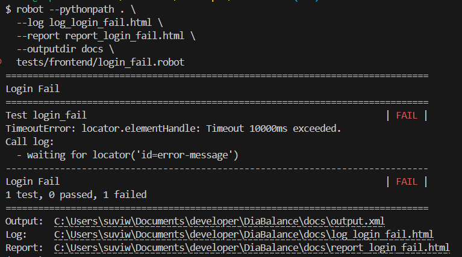
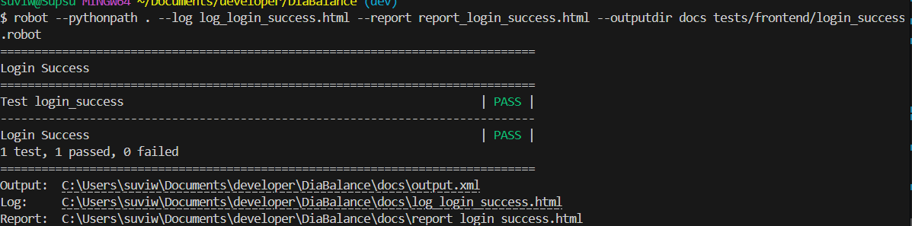
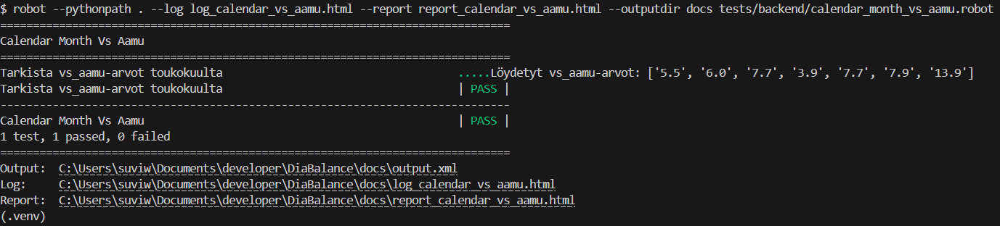

# Robot Framework -testaus

Tässä projektissa on toteutettu käyttöliittymän automaatiotestit Robot Frameworkin ja Browser-kirjaston avulla.

Projektiin liittyvät Python-kirjastot on määritelty tiedostossa `requirements.txt`.

---

## Testien käyttöönotto

### Virtuaaliympäristön aktivointi (Windows, esim. PowerShell tai Git Bash)
```bash
source .venv/Scripts/activate
```

### Riippuvuuksien asennus
```bash
pip install -r requirements.txt
```

---

## Testitiedostojen sijainnit

- Testit: [`tests/frontend/`](../tests/frontend/)
- Resurssit: [`resources/`](../resources/)
- Raportit ja julkaisu: [`docs/`](../docs/)

---

## Testattavat käyttötapaukset

| Käyttötapaus | Tunnus |
|--------------|--------|
| Rekisteröityminen | - |
| Epäonnistunut kirjautuminen | KI_1 |
| Onnistunut kirjautuminen | KI_1 |
| Uuden kalenterimerkinnän lisääminen | DI_1 |
| Kalenterimerkinnän muokkaus | DO_1 |
| Kalenterimerkinnän poistaminen | DI_2 |
| HRV-datan hakeminen Kubioksesta | - |
| Uloskirjautuminen | - |

---

## Testitulokset

### Käyttäjätunnistautuminen frontend

#### Rekisteröityminen
- [Rekisteröityminen – raportti](report_register_success.html)
- [Rekisteröityminen – loki](log_register_success.html)

#### Kirjautuminen epäonnistuu
- [Kirjautuminen FAIL – raportti](report_login_fail.html)
- [Kirjautuminen FAIL – loki](log_login_fail.html)
- 

#### Kirjautuminen onnistuu
- [Kirjautuminen SUCCESS – raportti](report_login_success.html)
- [Kirjautuminen SUCCESS – loki](log_login_success.html)
- 

#### Uloskirjautuminen
- [Uloskirjautuminen – raportti](report_logout.html)
- [Uloskirjautuminen – loki](log_logout.html)

---

### Kalenterimerkinnät frontend

#### Uuden merkinnän lisääminen
- [Uusi merkintä – raportti](report_new_entry.html)
- [Uusi merkintä – loki](log_new_entry.html)

#### Merkinnän muokkaus
- [Muokattu merkintä – raportti](report_update_entry.html)
- [Muokattu merkintä – loki](log_update_entry.html)

#### Merkinnän poistaminen
- [Poistettu merkintä – raportti](report_delete_entry.html)
- [Poistettu merkintä – loki](log_delete_entry.html)

---

### Terveystiedot HRV

#### HRV-datan haku Kubioksesta
- [HRV-datan haku – raportti](report_get_HRV_data.html)
- [HRV-datan haku – loki](log_get_HRV_data.html)

---

### Taustapalvelun testaaminen

#### API-virhekäsittelytesti. Testi tarkistaa, että /api/auth/login palauttaa 401 Unauthorized ja virheilmoituksen "Virheellinen käyttäjätunnus" väärillä tunnuksilla.
- [Virheellinen kirjautuminen - raportti](report_login_invalid.html)
- [Virheellinen kirjautuminen - loki](log_login_invalid.html)

#### Validointitesti. Testataan sitä, mitä tapahtuu kun syötetään puutteellista tai virheellisesti muotoiltua dataa, esimerkiksi puuttuva salasana tai liian lyhyt käyttäjänimi
- [Validonti: puuttuva salasanaa](report_login_validation.html)
- [Validointi: puuttuva salasana](log_login_validation.html)

#### Onnistunut kirjautuminen – backend API
- [Kirjautuminen onnistuu – raportti](report_login_success_backend.html)
- [Kirjautuminen onnistuu – loki](log_login_success_backend.html)

#### kahden merkinnän lisääminen
- [Kahden merkinnän lisäys - raportti](report_calendar_entries.html)
- [Kahden merkinnän lisäys - loki](log_calendar_entries.html)

#### Toukokuun vs_aamu arvojen hakeminen
- [Toukokuun vs_aamu arvot - raportti](report_calendar_vs_aamu.html)
- [Toukokuun vs_aamu arvot - loki](log_calendar_vs_aamu.html)
- 

#### Aiemman merkinnän muokkaaminen
- [Muokattu merkintä - raportti](report_update_entry_backend.html)
- [Muokattu merkintä - loki](log_update_entry_backend.html)

#### Aiemman merkinnän poistaminen
- [Merkinnän poistaminen - raportti](report_delete_entry_backend.html)
- [Merkinnän poistaminen - loki](log_delete_entry_backend.html)


## Testien ajokomennot

```bash
robot --pythonpath . --log log_register_success.html --report report_register_success.html --outputdir docs tests/frontend/register_success.robot

robot --pythonpath . --log log_login_fail.html --report report_login_fail.html --outputdir docs tests/frontend/login_fail.robot

robot --pythonpath . --log log_login_success.html --report report_login_success.html --outputdir docs tests/frontend/login_success.robot

robot --pythonpath . --log log_new_entry.html --report report_new_entry.html --outputdir docs tests/frontend/new_entry.robot

robot --pythonpath . --log log_update_entry.html --report report_update_entry.html --outputdir docs tests/frontend/update_entry.robot

robot --pythonpath . --log log_delete_entry.html --report report_delete_entry.html --outputdir docs tests/frontend/delete_entry.robot

robot --pythonpath . --log log_get_HRV_data.html --report report_get_HRV_data.html --outputdir docs tests/frontend/get_HRV_data.robot

robot --pythonpath . --log log_logout.html --report report_logout.html --outputdir docs tests/frontend/log_out.robot

robot --pythonpath . --log log_login_invalid.html --report report_login_invalid.html --outputdir docs tests/backend/login_invalid.robot

robot --pythonpath . --log log_login_validation.html --report report_login_validation.html --outputdir docs tests/backend/login_validation.robot

robot --pythonpath . --log log_login_success_backend.html --report report_login_success_backend.html --outputdir docs tests/backend/login_success.robot

robot --pythonpath . --log log_calendar_entries.html --report report_calendar_entries.html --outputdir docs tests/backend/calendar_entries.robot

robot --pythonpath . --log log_calendar_vs_aamu.html --report report_calendar_vs_aamu.html --outputdir docs tests/backend/calendar_month_vs_aamu.robot

robot --pythonpath . --log log_update_entry_backend.html --report report_update_entry_backend.html --outputdir docs tests/backend/update_entry.robot

robot --pythonpath . --log log_delete_entry_backend.html --report report_delete_entry_backend.html --outputdir docs tests/backend/delete_entry.robot

```

---


## Huomio

- HTML-raportit ja lokit ylikirjoitetaan jokaisen ajon yhteydessä.
- Jos haluaa säilyttää kaikki aiemmat testitulokset, kannattaa käyttää uniikkeja tiedostonimiä tai alikansioita.
