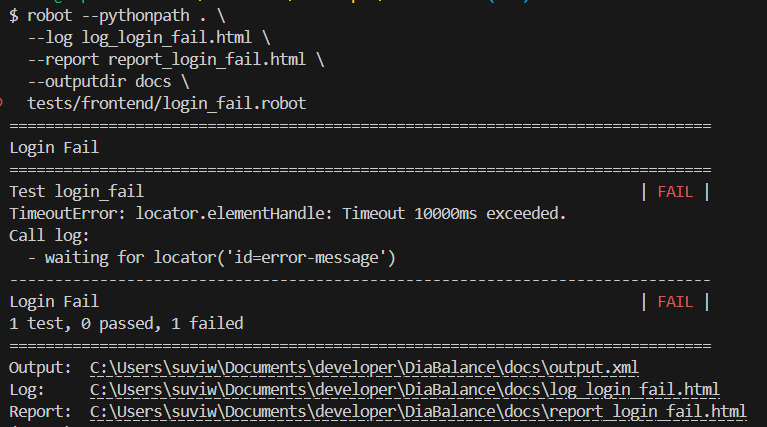
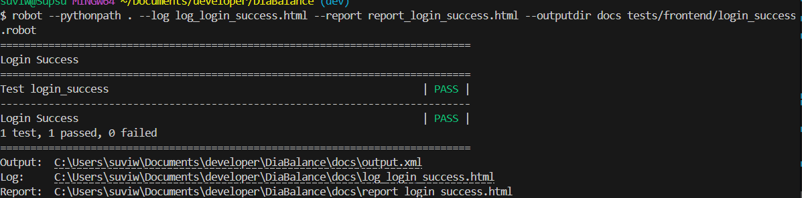
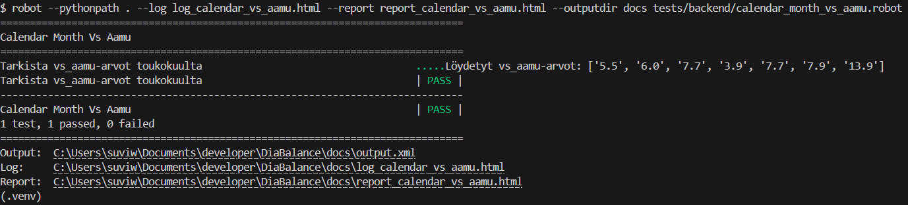

# Robot Framework -testaus

Tässä projektissa on toteutettu käyttöliittymän automaatiotestit Robot Frameworkin ja Browser-kirjaston avulla.

Projektiin liittyvät Python-kirjastot on määritelty tiedostossa `testing/requirements.txt`.

---

## Testien käyttöönotto

### Virtuaaliympäristön luonti ja aktivointi (Windows, esim. PowerShell tai Git Bash)
```bash
python -m venv .venv
source .venv/Scripts/activate
```

### Riippuvuuksien asennus
```bash
pip install -r testing/requirements.txt
```

---

## Testitiedostojen sijainnit

- Testit: [`testing/tests/`](../testing/tests/)
- Resurssit: [`testing/resources/`](testing/resources/)
- Raportit ja julkaisu: [`testing/results/`](testing/results/)

---

## Testattavat käyttötapaukset

| Käyttötapaus | Tunnus |
|--------------|--------|
| Rekisteröityminen | KI_3 |
| Epäonnistunut kirjautuminen | KI_1 |
| Onnistunut kirjautuminen | KI_1 |
| Uuden kalenterimerkinnän lisääminen | DI_1 |
| Kalenterimerkinnän muokkaus | DO_1 |
| Kalenterimerkinnän poistaminen | DI_2 |
| HRV-datan hakeminen Kubioksesta | KI_4 |
| Uloskirjautuminen | KI_2 |
| Chartin tarkastelu | DO_3 |

---

## Testit ajettiin vielä kertaallen läpi, kun siirryttiin mainiin ja koodissa oli tehty hieman muutoksia. Tällä kertaa tehtiin ajot hieman eri tavoin:

## Testien suorituskomennot (Robot Framework)
Tulokset tallentuvat kansioon `testing/results`. Jokainen komento ajetaan erikseen, ja tulokset (log.html, report.html) nimetään käsin halutulla tavalla testin mukaan.

Viimeisimpien testien tulokset löytyvät
- Raportit ja julkaisu: [`testing/results/`](../testing/results/latest)

### Frontend-testit
```bash
robot -d testing/results testing/tests/frontend/register_success.robot
robot -d testing/results testing/tests/frontend/login_fail.robot
robot -d testing/results testing/tests/frontend/login_success.robot
robot -d testing/results testing/tests/frontend/new_entry.robot
robot -d testing/results testing/tests/frontend/update_entry.robot
robot -d testing/results testing/tests/frontend/delete_entry.robot
robot -d testing/results testing/tests/frontend/get_HRV_data.robot
robot -d testing/results testing/tests/frontend/log_out.robot
```

### Backend-testit
```bash
robot -d testing/results testing/tests/backend/login_invalid.robot
robot -d testing/results testing/tests/backend/login_validation.robot
robot -d testing/results testing/tests/backend/login_success.robot
robot -d testing/results testing/tests/backend/calendar_entries.robot
robot -d testing/results testing/tests/backend/calendar_month_vs_aamu.robot
robot -d testing/results testing/tests/backend/update_entry.robot
robot -d testing/results testing/tests/backend/delete_entry.robot
```

---

Tee testin ajon jälkeen:
- Nimeä `log.html` ja `report.html` testin mukaan (esim. `log_login_success.html`).
- Siirrä ne oikeaan alikansioon projektin `results/`-rakenteessa, esimerkiksi `results/latest/reports` ja `results/latest/logs`.

Näin varmistat, että tulokset säilyvät ja ovat selkeästi eroteltavissa.

---


## Testitulokset ennen mainiin siirtymistä

### Käyttäjätunnistautuminen frontend

#### Rekisteröityminen
- [Rekisteröityminen – raportti](../testing/results/old/reports/report_register_success.html)
- [Rekisteröityminen – loki](../testing/results/old/logs/log_register_success.html)

#### Kirjautuminen epäonnistuu
- [Kirjautuminen FAIL – raportti](../testing/results/old/reports/report_login_fail.html)
- [Kirjautuminen FAIL – loki](../testing/results/old/logs/log_login_fail.html)
- 

#### Kirjautuminen onnistuu
- [Kirjautuminen SUCCESS – raportti](../testing/results/old/reports/report_login_success.html)
- [Kirjautuminen SUCCESS – loki](../testing/results/old/logs/log_login_success.html)
- 

#### Uloskirjautuminen
- [Uloskirjautuminen – raportti](../testing/results/old/reports/report_logout.html)
- [Uloskirjautuminen – loki](../testing/results/old/logs/log_logout.html)

---

### Kalenterimerkinnät frontend

#### Uuden merkinnän lisääminen
- [Uusi merkintä – raportti](../testing/results/old/reports/report_new_entry.html)
- [Uusi merkintä – loki](../testing/results/old/logs/log_new_entry.html)

#### Merkinnän muokkaus
- [Muokattu merkintä – raportti](../testing/results/old/reports/report_update_entry.html)
- [Muokattu merkintä – loki](../testing/results/old/logs/log_update_entry.html)

#### Merkinnän poistaminen
- [Poistettu merkintä – raportti](../testing/results/old/reports/report_delete_entry.html)
- [Poistettu merkintä – loki](../testing/results/old/logs/log_delete_entry.html)

---

### Terveystiedot HRV

#### HRV-datan haku Kubioksesta
- [HRV-datan haku – raportti](../testing/results/old/reports/report_get_HRV_data.html)
- [HRV-datan haku – loki](../testing/results/old/logs/log_get_HRV_data.html)

---

### Taustapalvelun testaaminen

#### API-virhekäsittelytesti. Testi tarkistaa, että /api/auth/login palauttaa 401 Unauthorized ja virheilmoituksen "Virheellinen käyttäjätunnus" väärillä tunnuksilla.
- [Virheellinen kirjautuminen - raportti](../testing/results/old/reports/report_login_invalid.html)
- [Virheellinen kirjautuminen - loki](../testing/results/old/logs/log_login_invalid.html)

#### Validointitesti. Testataan sitä, mitä tapahtuu kun syötetään puutteellista tai virheellisesti muotoiltua dataa, esimerkiksi puuttuva salasana tai liian lyhyt käyttäjänimi
- [Validonti: puuttuva salasanaa](../testing/results/old/reports/report_login_validation.html)
- [Validointi: puuttuva salasana](../testing/results/old/logs/log_login_validation.html)

#### Onnistunut kirjautuminen – backend API
- [Kirjautuminen onnistuu – raportti](../testing/results/old/reports/report_login_success_backend.html)
- [Kirjautuminen onnistuu – loki](../testing/results/old/logs/log_login_success_backend.html)

#### kahden merkinnän lisääminen
- [Kahden merkinnän lisäys - raportti](../testing/results/old/reports/report_calendar_entries.html)
- [Kahden merkinnän lisäys - loki](../testing/results/old/logs/log_calendar_entries.html)

#### Toukokuun vs_aamu arvojen hakeminen
- [Toukokuun vs_aamu arvot - raportti](../testing/results/old/reports/report_calendar_vs_aamu.html)
- [Toukokuun vs_aamu arvot - loki](../testing/results/old/logs/log_calendar_vs_aamu.html)
- 

#### Aiemman merkinnän muokkaaminen
- [Muokattu merkintä - raportti](../testing/results/old/reports/report_update_entry_backend.html)
- [Muokattu merkintä - loki](../testing/results/old/logs/log_update_entry_backend.html)

#### Aiemman merkinnän poistaminen
- [Merkinnän poistaminen - raportti](../testing/results/old/reports/report_delete_entry_backend.html)
- [Merkinnän poistaminen - loki](../testing/results/old/logs/log_delete_entry_backend.html)


## Testien ajokomennot

```bash
robot --pythonpath . --log log_register_success.html --report report_register_success.html --outputdir docs tests/frontend/register_success.robot

robot --pythonpath . --log log_login_fail.html --report report_login_fail.html --outputdir docs tests/frontend/login_fail.robot

robot --pythonpath . --log log_login_success.html --report report_login_success.html --outputdir docs tests/frontend/login_success.robot

robot --pythonpath . --log log_new_entry.html --report report_new_entry.html --outputdir docs tests/frontend/new_entry.robot

robot --pythonpath . --log log_update_entry.html --report report_update_entry.html --outputdir docs tests/frontend/update_entry.robot

robot --pythonpath . --log log_delete_entry.html --report report_delete_entry.html --outputdir docs tests/frontend/delete_entry.robot

robot --pythonpath . --log log_get_HRV_data.html --report report_get_HRV_data.html --outputdir docs tests/frontend/get_HRV_data.robot

robot --pythonpath . --log log_logout.html --report report_logout.html --outputdir docs tests/frontend/log_out.robot

robot --pythonpath . --log log_login_invalid.html --report report_login_invalid.html --outputdir docs tests/backend/login_invalid.robot

robot --pythonpath . --log log_login_validation.html --report report_login_validation.html --outputdir docs tests/backend/login_validation.robot

robot --pythonpath . --log log_login_success_backend.html --report report_login_success_backend.html --outputdir docs tests/backend/login_success.robot

robot --pythonpath . --log log_calendar_entries.html --report report_calendar_entries.html --outputdir docs tests/backend/calendar_entries.robot

robot --pythonpath . --log log_calendar_vs_aamu.html --report report_calendar_vs_aamu.html --outputdir docs tests/backend/calendar_month_vs_aamu.robot

robot --pythonpath . --log log_update_entry_backend.html --report report_update_entry_backend.html --outputdir docs tests/backend/update_entry.robot

robot --pythonpath . --log log_delete_entry_backend.html --report report_delete_entry_backend.html --outputdir docs tests/backend/delete_entry.robot

```

---
## Testien suorittaminen yhdellä komennolla

Kaikkien testien ajaminen yhdellä komennolla ei ole tässä projektissa mahdollista ilman lisävalmistelua.
Tähän vaikuttavat seuraavat syyt:

| Testi | Miksi ongelmallinen? |
|:-----|:---------------------|
| Rekisteröityminen | Samalla käyttäjätunnuksella voi rekisteröityä vain kerran → jos sama tunnus, toinen ajo FAIL. |
| Uuden kalenterimerkinnän lisääminen | Sama päivämäärä + käyttäjä voi saada Duplicate Key -virheen → FAIL. |
| Merkinnän muokkaaminen | Ok, toimii, jos merkintä on olemassa. |
| Merkinnän poistaminen | Poiston jälkeen sama testi ei enää löydä merkintää → FAIL. |

---

**Yhteenveto:**

Monet testit ovat **tilariippuvaisia** (eli riippuvat siitä mitä tietokannassa jo on), jolloin "ajettavuus yhdellä komennolla" ei ole mahdollista ilman isompaa valmistelua (esim. automaattinen tietokannan resetointi ennen ajoa).

Testit on rakennettu ajettaviksi **yksittäin tai oikeassa järjestyksessä**, mikä on tässä projektissa käytännönläheinen ratkaisu.

Kaikki testit voi periaatteessa ajaa komennolla:

```bash
robot --pythonpath . tests
```

Tai raportit `docs/`-kansioon:

```bash
robot --pythonpath . --outputdir docs tests
```
Mutta osa testeistä tosiaan epäonnistuisi, joten emme aio käyttää näitä komentoja testeissämme.


## Huomio

- HTML-raportit ja lokit ylikirjoitetaan jokaisen ajon yhteydessä.
- Jos haluaa säilyttää kaikki aiemmat testitulokset, kannattaa käyttää uniikkeja tiedostonimiä tai alikansioita.
